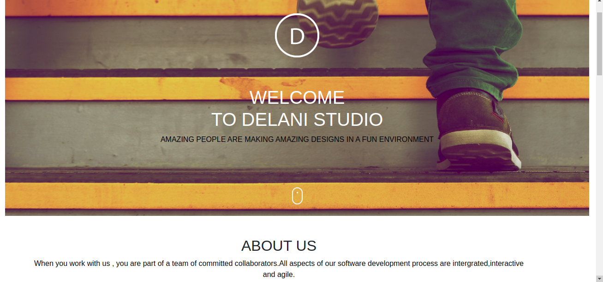
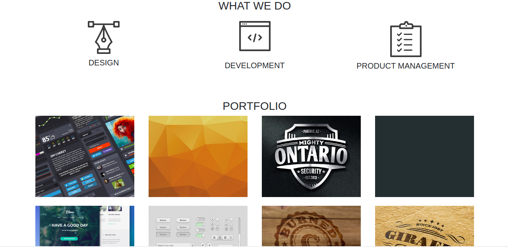
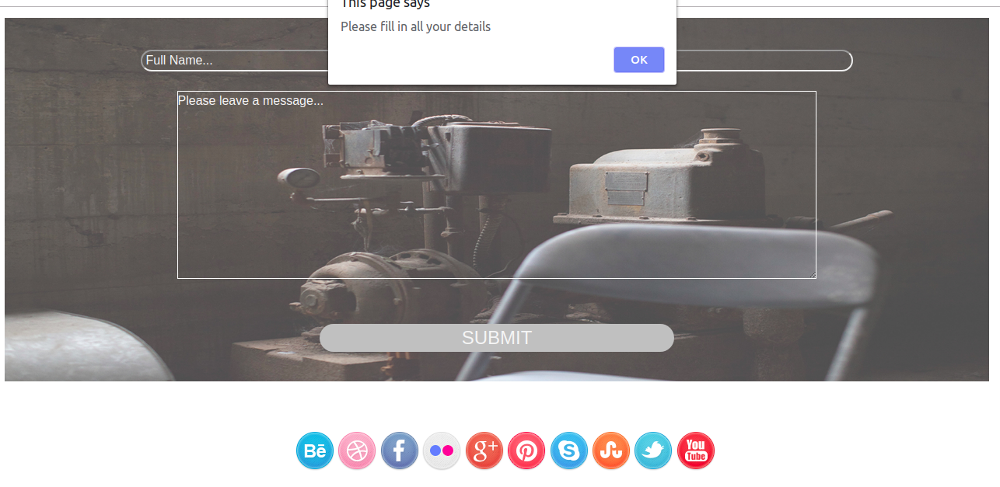

# DELANI STUDIO

#### 1st November 2019

#### Authors

- [nessa-waithaka](https://github.com/nessa-waithaka)

## Description

The Delani Studio project is a website created using JavaScript, JQuery and basic Bootstrap functions.It is meant to test on the various functions and styles learnt throughout the period of learning.

## Screenshots

## Setup/Installation Requirements

To start using this project use the following commands:

- `git clone https://github.com/nessa-waithaka/Delani-Studio.git`
- `cd Delani-Studio`
- `atom .`
- `code .` [//]: # (this is if Visual Studio Code is your preferred text editor)

## Technologies used

- HTML
- CSS
- Javascript
- Jquery
- Bootstrap

## Behavior Driven Development (BDD)

| Behavior                | Input                        | Output                          |
| :---------------------- | :--------------------------- | :------------------------------ |
| View What We Do         | Click on What We Do icons    | What We Do descriptions         |
| View Portfolio projects | Hover on Portfolio images    | Project names displayes         |
| Send Email              | Enter name,email and message | Alert box message email is sent |

## Known Bugs

Social media links currently not functioning. This will be fixed before deployment.

## Support and contact details

Incase of any issues, questions, ideas or concerns. Make acontribution to the code by contacting me through [vanessa.waithaka@gmail.com](vanessa.waithaka@gmail.com) .

### License

_MIT LICENSE_  
Copyright (c) 2019 **Vanessa Waithaka**
